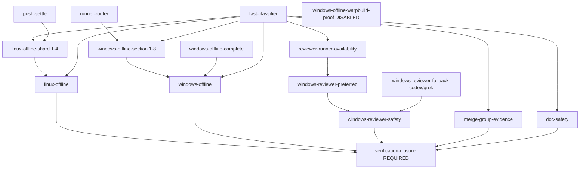

# Implementation plan — CI / reviewers / runners remediation (2026-10-02)

Owner issue: **TBD — open before implementation.** One parent issue owns this
programme; every unproven outcome leaves a `- [ ] live proof` checklist item on
that same issue. Do not open leftover-proof issues.

Dated companion pointer:
[`docs/plan-ci-reviewers-runners-remediation-2026-10-02.md`](docs/plan-ci-reviewers-runners-remediation-2026-10-02.md).

Trigger document:
[`docs/2026-10-02-transcript-root-cause-reviewers-ci-runners.md`](docs/2026-10-02-transcript-root-cause-reviewers-ci-runners.md)
(origin/main `9fafcd2`, PR #1267). Baseline not re-solved here:
[`docs/ci-failures-and-github-rate-limit-report-2026-09-29.md`](docs/ci-failures-and-github-rate-limit-report-2026-09-29.md)
and complete [`plan_split-ci-suite-manifest.md`](plan_split-ci-suite-manifest.md).

## STATUS

All steps open at publication. This is a planning deliverable, **not**
authorization to execute every row in one session. One phase row per session;
use `fresh-session` at each natural cut point. A row is `done` only with its
live-proof artifact linked — a merged PR, a green run, or an installed doctor
output. Presence is not capability.

| Phase | Step | State | Evidence required for done |
|---|---|---|---|
| A | A1 Qwen folder ACL repaired on al8960ofc | ⬜ open | `ai-qwen` runs and enforces its security boundary on that machine; no access-denied / exit 5 |
| A | A2 Lifecycle launchers installed on al8960ofc | ⬜ open | `ai-reviewer-start-watch` (and `.cmd`) and `ai-install-post-merge-hook` resolve from PATH; doctor stops reporting them missing |
| A | A3 `ai-devops doctor` clean on every reviewer machine | ⬜ open | Dated doctor output from edge-dev, edge-dev3, al8960ofc (and every `run_on_host`) showing zero missing launchers and healthy provider folders |
| A | A4 Missing-launcher / broken-folder defect is a named hard failure | ⬜ open | Doctor or install-manifest check fails closed; focused test proves it |
| B | B1 Blacksmith / GitHub-hosted / WarpBuild routing story reconciled in docs | ⬜ open | `docs/warpbuild-azure-byoc.md` and `warpbuild-win2022-canary.yml` header agree with `config/ci-runner-routing.json` and `verify.yml` |
| B | B2 Disabled WarpBuild proof lane is never read as proof | ⬜ open | Written disposition: skipped `windows-offline-warpbuild-proof` ⇒ named proof debt, not silence |
| B | B3 WarpBuild pool actually picks up jobs (#961) | ⬜ open | Canary green on the label plus one full `windows-offline-warpbuild` dispatch on a real ref |
| B | B4 Public-repo runner groups allow public jobs; forks never reach Azure | ⬜ open | Runner-group setting read + recorded; fork PR cannot hit `warp-custom-*` |
| B | B5 Stuck free-lane routing is a deliberate paid action | ⬜ open | One real PR where `windows-offline-warpbuild.yml` was dispatched with `requester_task` + `purpose`, or the free lane finished |
| C | C1 BlockerWatch row 0 — live incident inventory | ⬜ open | Redacted baseline under `tests/verification/blocker-watch/` |
| C | C2 BlockerWatch rows 1–7 land in order | ⬜ open | Each row's §10 tests + one live resume; `plan_blockerwatch-reliability-repair` STATUS updated |
| C | C3 Reviewer-reliability acceptance rows closed (#393, #394) | ⬜ open | Governed live comparison + incident reconciliation in the named evidence files |
| C | C4 Timeout vs failure separated (workflow-efficiency P7) | ⬜ open | Timeout/identity tests + one scoped installed live proof of the distinct terminal state |
| D | D1 #658 guarded installation + measured acceptance | ⬜ open | Dated measured report; P5 finished before any multi-App split |
| D | D2 `plan_cut-unneeded-github-traffic` S4 before/after sample | ⬜ open | Comparable report under `tests/verification/github-requests/` |
| D | D3 Hard cap on concurrent review runs + waiter polling | ⬜ open | Enforced cap demonstrated on a clustered burst; refusals name who is waiting |
| E | E1 Proof-debt discipline written into delivery rules | ⬜ open | Task-router / standing-rules text landed; one real proof-debt item opened and later closed with live proof |
| E | E2 Doc-only merge rule reconciled to one sentence | ⬜ open | Templates + installed copies agree; this plan's own PR merged the normal way without `--admin` |
| E | E3 Completion honesty: installed-and-proven only | ⬜ open | One plan row closed only after its live-proof artifact is linked; no row closed on docs alone |

## 1. Ultimate goal

Albert's machines should be able to run a reviewer, finish a CI proof, and land
a change **with real evidence**, without sessions inventing workarounds when
something is stuck. A repair is done when the capability works live on the
machine — not when the code merged. When a proof cannot run, that gap is named
and tracked, never absorbed in silence.

## 2. What this application is / current CI topology

`popcre/ai-devops` is the public recovery and governance toolkit. There is no
deployed service: "installation" means the toolkit is on a machine, and
"deployment" is that install (`docs/deployment.md`). CI is `.github/workflows/verify.yml`;
the only required status context is `verification-closure` (ruleset `21564317`,
`docs/ai-devops-required-checks-gap.md`).

## 3. Trigger

[`docs/2026-10-02-transcript-root-cause-reviewers-ci-runners.md`](docs/2026-10-02-transcript-root-cause-reviewers-ci-runners.md)
(72-hour window 2026-09-29 → 2026-10-02, PR #1267). It names five root causes
still open and notes that FM-1 (CI pileup) is fixed by the complete
`plan_split-ci-suite-manifest`, while FM-5 (flaky timing) is quiet. The
dominant remaining CI/runner failure shape is the **WarpBuild proof lane**
(cancelled/stuck proofs, merged rather than rerun).

## 4. Scope

**In scope:** machine-install gaps that block reviewers; the WarpBuild proof
lane and Windows runner routing truth; finishing the open BlockerWatch and
reviewer-reliability plan rows; a hard GitHub API traffic budget; proof-debt and
completion-honesty rules; the doc-only merge-rule conflict.

**Out of scope:** see §9.

## 5. Current state (what CI actually does today)

Real names, runners, and timeouts as of `9fafcd2`:

| Job | Event | Runner | Timeout | Notes |
|---|---|---|---|---|
| `fast-classifier` | `workflow_call` | `ubuntu-24.04` | 3 min | Selection + fast validation, fail-closed; missing result is never success |
| `push-settle` | PR | `ubuntu-24.04` | 5 min | Quiet window for abandoned pushes |
| `linux-offline-shard` | PR/merge_group/schedule | `ubuntu-24.04` | 45 min | Matrix shards 1–4 |
| `linux-offline` | same | `ubuntu-24.04` | 5 min | Aggregate |
| `merge-group-evidence` | merge_group | `ubuntu-24.04` | 10 min | Refuses a queue entry whose exact-head run is unfinished |
| `doc-safety` | all | `ubuntu-24.04` | 5 min | Public boundary + local Markdown links |
| `runner-router` | PR only | `ubuntu-24.04` | 3 min | Reads `config/ci-runner-routing.json` + `tools/ci/runner-router.cjs`; emits `windows_matrix` |
| `windows-offline-section` | PR only | `${{ matrix.runs_on }}` (router) | **90 min** | 8 sections since 2026-09-29 (#185); literal fallback is all-GitHub `windows-2025` |
| `windows-offline-warpbuild-proof` | PR only, **DISABLED** | `warp-custom-warpbuild-win2022-canary` | 40 min | `if: false && …` (verify.yml:351-352); `continue-on-error: true`; `max-parallel: 2`; **outside** every required aggregate |
| `windows-offline-complete` | schedule/dispatch | `windows-2025` | 105 min | 5-section complete backstop |
| `windows-offline` | all but merge_group | `ubuntu-24.04` | 5 min | Fail-closed aggregate; stable name for #166 |
| `reviewer-runner-availability` | not merge_group | `ubuntu-24.04` | 3 min | Samples ENVY / qualified pool |
| `windows-reviewer-preferred` | PR/dispatch | `[self-hosted, Windows, X64, ai-devops-windows-qualified]` | 60 min | e.g. edge-runn-envy |
| `reviewer-safety-start-deadline` | — | `ubuntu-24.04` | 3 min | Bounds the self-hosted start |
| `windows-reviewer-fallback-codex` / `-grok` | when preferred absent | `windows-2025` | 120 min | GitHub-hosted fallback |
| `windows-reviewer-safety` | — | `ubuntu-24.04` | 5 min | Aggregate proof |
| `verification-closure` | PR + merge_group | `ubuntu-24.04` | 5 min | **The only required context** |
| `report-scheduled-failure` | schedule | `ubuntu-24.04` | 3 min | Opens/updates a scheduled incident |

Companion workflows: `windows-offline-warpbuild.yml` (dispatch-only overflow,
`warp-custom-warpbuild-win2022-canary`, 20 min, needs `ref` + `requester_task` +
`purpose`); `warpbuild-win2022-canary.yml` (manual canary, non-required);
`windows-runner-qualification.yml` (`[self-hosted, Windows, X64, ai-devops-windows]`,
150 min); `runner-pool-watchdog.yml` (hourly, outside-pool check via
`RUNNER_POOL_READ_TOKEN`); `windows-queue-watchdog.yml` (on `verify` in_progress,
8 min, comments when sections do not pick up — never dispatches paid WarpBuild
itself); `stuck-work-watchdog.yml` (dispatch only; scheduled from
`ai-blocker-watch` ticks); `merge-queue-drift.yml` (daily + PR paths);
`reviewer-membership-drift.yml`; `docs-reachability.yml`.

**Runner routing (`config/ci-runner-routing.json`, schema 3):** Blacksmith is
**out of the pool** (owner decision 2026-10-01, recorded in the file `_comment`).
Preference: idle qualified self-hosted (`ai-devops-windows-qualified`) →
GitHub-hosted `windows-2025` (limit 8) → WarpBuild
(`warp-custom-warpbuild-win2022-canary`) as final option.
`windows_sections: 8`. Fork protection: repository `all_external_contributors`
Actions approval policy + head-repo guard in the matrix expression.

**Suite manifest:** `config/ci-suites/*.json` (split landed, complete —
`plan_split-ci-suite-manifest` steps 0–5 done 2026-09-30). Do not rebuild it.

## 6. Root causes mapped to CI / runner / reviewer config

| Root cause (2026-10-02 report) | Where it actually lives |
|---|---|
| **1. Machine-install gap.** Qwen ACLs broken on al8960ofc (access denied / exit 5); missing `ai-reviewer-start-watch` and post-merge hook launchers. Repo code fine. | Not a repo defect: `bin/ai-reviewer-start-watch`, `bin/ai-reviewer-start-watch.cmd`, `bin/ai-install-post-merge-hook(.cmd)` all exist at `9fafcd2`. The gap is machine PATH / ACL state. Found late by `ai-devops doctor` (`tests/test-ai-devops-doctor-install-state.sh`). |
| **2. Proof gaps accepted under pressure.** WarpBuild proofs cancelled/stuck; merged rather than rerun. | `verify.yml:345-382` `windows-offline-warpbuild-proof` is disabled (`if: false &&`, :351-352) with `continue-on-error: true`, deliberately outside `verification-closure`'s `needs`. `windows-offline-warpbuild.yml` is dispatch-only. Nothing mechanical forces a rerun when a proof is skipped. |
| **3. Shared API quota overwhelmed** (344 secondary-limit hits / 142 files; 106 out-of-credit hits / 55 files). | Volume of watchers/waiters/review runs. `plan_github-request-reduction.md` measurement: BlockerWatch ≈ 95% of traffic, so P5 has the largest payoff. Staggering + identity split reduced bursts, not volume. |
| **4. Repair plans structurally incomplete.** | `plan_blockerwatch-reliability-repair.md` — **all 7 rows open** (registration, resume, recovery lifecycle, dependency scanning, enforced registration, staged rollout, reconciliation). `plan_reviewer-reliability-and-efficiency.md` — acceptance rows still need evidence (#393/#394). `plan_workflow-efficiency.md` — P7 open (timeouts masquerading as bad reviewers); P0/P1/P2/P8–P10 open. |
| **5. False completion without live proof.** | No gate closes "installed on machine" or "proof debt". `verification-closure` closes CI paths only. The standing rule exists as instruction, not mechanism. |
| **(Cross-cutting) Rule conflict.** | `templates/system/AGENTS-global-mimo.md:234` (and codex/zcode/`CLAUDE-global.md:197`) after `5ffde66` say doc-only PRs merge "the normal way (merge queue where one exists, never `--admin`)"; installed standing rules still carry the older `gh pr merge --squash --admin` sentence. |
| **(Cross-cutting) Stale routing prose.** | `docs/warpbuild-azure-byoc.md` ("Required CI is still Blacksmith… do not turn Blacksmith off") and the `warpbuild-win2022-canary.yml` header contradict `config/ci-runner-routing.json` and `verify.yml:293` ("Blacksmith is turned off and is not a target"). Live required Windows runs are GitHub-hosted `windows-2025` + idle qualified self-hosted. |

## 7. Phased work plan

Every phase carries its own observable success check and **explicit live proof**.
No phase closes on a merged PR alone.

### Phase A — Machine-install repairs (quick, local, currently blocking)

**Goal:** every machine that runs a reviewer has every lifecycle launcher and
healthy provider folders, and `ai-devops doctor` is clean there *before* work is
blocked. Report priority #1.

**Steps**

1. **A1 — Qwen ACL on al8960ofc.** Repair the Qwen state-directory ACL that
   fails with access denied / exit 5. Confine the fix to that directory; never a
   broad ACL rewrite. If the operating system still refuses the change (the
   #262 UAC / remote-token-filtering shape), record the exact refusal as a
   machine-local Windows defect and stop before weakening the wrapper's security
   boundary — the wrapper must keep refusing to run rather than run uncontained.
2. **A2 — Install missing launchers on al8960ofc.** `ai-reviewer-start-watch`
   (extensionless and `.cmd`) and `ai-install-post-merge-hook` (and `.cmd`).
   These are install/sync gaps, not code gaps. They are the tools that detect a
   reviewer drawn-but-never-started and that install post-merge behaviour;
   without them the lifecycle silently degrades.
3. **A3 — Doctor clean everywhere a reviewer runs.** Run `ai-devops doctor` on
   edge-dev, edge-dev3, al8960ofc, and every host named in
   `config/reviewer-start-watch.json` `run_on_host`. Fix every reported defect.
   "Doctor clean" is the machine-readiness acceptance.
4. **A4 — Make the defect class loud.** Ensure a missing launcher or broken
   provider folder is a named hard failure in doctor / install-manifest
   (`tests/test-ai-devops-doctor-install-state.sh`, `tests/test-ai-install-manifest.sh`),
   so it is caught before work is blocked rather than after.

**Reuse:** `plan_sync-machine-wrapper-reconciliation.md` and the existing doctor /
install-manifest surface own the checks. New code only if a named check is
missing.

**Acceptance evidence (live proof required):**
- Dated doctor output from each machine showing zero missing launchers and
  healthy provider folders.
- One real Qwen reviewer call on al8960ofc returns a terminal verdict.
- One `ai-reviewer-start-watch` tick (or its documented dry run) completes
  without a missing-launcher error.

**Risk:** Windows ACL work can be refused under a non-elevated remote token.
That is a `Blocked —` outcome for the machine, not a reason to bypass the
boundary. A1 must not turn into an elevation-policy change.

### Phase B — CI / runner reliability (WarpBuild proof lane + routing truth)

**Goal:** a proof lane either completes and is citable, or the gap is named and
tracked. WarpBuild becomes a reliable overflow/proof lane **without** moving
required CI. This is the dominant failure shape in the window.

**Steps**

1. **B1 — Reconcile the Blacksmith / GitHub-hosted / WarpBuild story.**
   `docs/warpbuild-azure-byoc.md` and the `warpbuild-win2022-canary.yml` header
   still say required CI is Blacksmith and "do not turn Blacksmith off", while
   `config/ci-runner-routing.json` and `verify.yml:293` record Blacksmith as out
   of the pool (owner 2026-10-01). Update the prose to the live decision and
   cite the routing file as the single source. Do **not** silently drop any lane
   from the routing config (the PR #1193 caution), and do not flip Blacksmith
   back on as a policy gesture — reconcile the documents to one owner ruling.
2. **B2 — Skipped proof is not proof.** While `windows-offline-warpbuild-proof`
   carries `if: false &&`, every session that would have needed that proof must
   leave a named proof-debt item (Phase E). Write the disposition next to the
   disabled guard in `verify.yml` and in the WarpBuild doc so the next session
   cannot read "job absent" as "proof done".
3. **B3 — Make WarpBuild actually pick up (#961).** Finish the Azure BYOC
   bring-up so `warp-custom-warpbuild-win2022-canary` accepts jobs (canary was
   green 2026-09-30, run `36731941680`). Only when the pool reliably picks up,
   re-enable `windows-offline-warpbuild-proof` with a **one-token** change (the
   guard body stays) as a non-required, `continue-on-error`, out-of-closure
   proof lane. **Required CI does not move to WarpBuild.** The cut-over branch
   `mimo/warpbuild-required-cutover` / PR #1220 stays unmerged until its
   failures are diagnosed and a separate reviewed cut-over is approved; PR #1193
   must not silently drop WarpBuild or Blacksmith.
4. **B4 — Public jobs on BYOC.** Confirm each WarpBuild runner group
   `allows_public_repositories` (this is a public repo). Keep the double fork
   guard: `all_external_contributors` approval policy plus the head-repo
   if-guard, so a foreign PR never reaches the Azure subscription's VMs.
5. **B5 — Stuck free-lane routing stays deliberate.** `windows-queue-watchdog`
   only comments; it never pays. When the free lane is stuck the named action is
   dispatching `windows-offline-warpbuild.yml` with `requester_task` + `purpose`
   (paid, deliberate) — or waiting. Never a silent merge around it.

**Reuse:** issue #961 and `docs/warpbuild-azure-byoc.md` own WarpBuild;
`windows-queue-watchdog` owns the slow-start alarm; `config/ci-runner-routing.json`
owns routing. New work is doc reconciliation plus the proof-debt disposition.

**Acceptance evidence (live proof required):**
- Routing prose and `config/ci-runner-routing.json` agree; `merge-queue-drift`
  stays green on the changed files.
- One full `windows-offline-warpbuild` dispatch succeeds on a real ref, and one
  canary run on the label is green.
- One real PR where a stuck/cancelled proof is either rerun to green on the
  exact head or carries a named proof-debt item on the owner issue.

**Risk:** re-enabling the proof lane before the pool picks up recreates the
"queued for hours holding the workflow open" failure. Keep `continue-on-error`
and the out-of-closure placement until a reviewed cut-over says otherwise.

### Phase C — Reviewer and BlockerWatch reliability (finish existing plans)

**Goal:** stuck waits and stuck reviews stop recurring because the structural
repairs land and are proven live. Do not invent competing plans.

**Steps**

1. **C1–C2 — `plan_blockerwatch-reliability-repair.md` (issue #632).** All seven
   deliverable rows are open. **Start at row 0** (reconcile live incidents and
   inventory every wait; baseline under `tests/verification/blocker-watch/`),
   then rows 1–7 in order — one phase per session. Registration stays the
   default for any wait over ~10 minutes. Until the plan's reconciliation and
   live-health gates are complete, verify registration, state-home ownership,
   harness readiness, scheduler health, and GitHub/local reconciliation rather
   than trusting task exit 0.
2. **C3 — `plan_reviewer-reliability-and-efficiency.md` (issue #337).** Close
   only the rows that still need evidence: #393 source identity (governed live
   comparison + affected incident reconciliation) and #394 terminal-outcome
   parity remainder. Do **not** reopen Complete rows (#395, #396, #397, #271,
   #333, #398, #169).
3. **C4 — `plan_workflow-efficiency.md` P7 (issue #650).** A transient health
   timeout must have its own terminal state and its own bounded retry, distinct
   from identity drift and authentication failure. Reconcile #622/#637. Leave
   P0/P1/P2/P8–P10 to their named rows; do not bundle them here.
4. **Do not restart** `plan_reviewer_lease_liveness.md` (#283) — complete in
   shared-db (`u2giants/shared-db#2351`). Do not treat
   `plan_reviewer-system-repair.md` step 3's packet premise as proven (its live
   A/B gate is explicitly not met); leave dropped step 5 dropped.

**Reuse:** those plans and issues are the owners. This plan only sequences them
against the 2026-10-02 evidence.

**Acceptance evidence (live proof required):**
- BlockerWatch row 0 baseline artifact, then each row's §10 tests **and** one
  live wait that registers and resumes correctly end-to-end.
- #393/#394 evidence files updated with live proof (not docs, not a demo).
- One observed reviewer/CI health timeout classified in the new distinct
  terminal state — proven not to be recorded as a bad review.

**Risk:** these are long-running. One row per session; a bundled "cleanup" pass
is how the previous rows stayed open.

### Phase D — Quota and traffic as a hard budget

**Goal:** total volume of background watchers, waiters, and review runs cannot
overwhelm the shared API budget, even when work clusters. Budget is a
first-class constraint, not an afterthought.

**Steps**

1. **D1 — Finish `plan_github-request-reduction.md` (#658).** Remaining:
   guarded installation and measured acceptance. Finish **P5 (BlockerWatch →
   existing App) before any multi-App split** (2026-09-29 finding 5 —
   BlockerWatch is ~95% of measured traffic). Lint direct `gh` calls; surface
   remaining quota in `ai-gh` output.
2. **D2 — Finish `plan_cut-unneeded-github-traffic.md` S4.** S1–S3 are done
   (snapshot reuse, shared PR status read, routed direct callers). S4 is the
   dated before/after traffic sample under `tests/verification/github-requests/`
   plus de-staling the parent STATUS. Known open caveats (ai-gh quota-state
   save-path bug, GraphQL telemetry label overwrite) get named owners, not
   silence.
3. **D3 — Hard caps.** Cap concurrent formal review runs and waiter polling per
   machine and per identity. The 09-30–10-01 burst (20+ review sessions in
   ~24h) shows demand can still overwhelm staggering + identity split. Prefer
   extending the existing paced gate and `bin/ai-gh` machine-wide lock over a
   new scheduler. A single fleet-wide review-run scheduler is a **decision
   gate**, not work in this plan. The #396 availability/cooldown/concurrency
   primitives are landed — consume them, do not rebuild them.

**Reuse:** #658 / #660 and `plan_cut-unneeded-github-traffic.md` own the
programme; `plan_reviewer-diagnostics-quota-preflight.md` (issue #312) owns
preflight. New work is only the enforcement point for the cap.

**Acceptance evidence (live proof required):**
- Dated comparable before/after traffic report under
  `tests/verification/github-requests/`.
- Secondary-limit hit rate down from the 344-hits / 142-files baseline over a
  comparable window, and out-of-credit refusals down from 106 / 55.
- One clustered burst of review runs + waiters either stays under the cap or
  produces a named refusal that says who is waiting.

**Risk:** a cap that refuses work must route the waiter into BlockerWatch /
proof debt with a named owner. A silent drop is worse than the rate limit.

### Phase E — Process / proof honesty and rule authority

**Goal:** a repair is only "done" when live proof exists; a bypassed proof is
always named; exactly one rule governs doc-only merges.

**Steps**

1. **E1 — Proof-debt discipline.** Default when a required proof is stuck or
   cancelled: fix or rerun the proof. If a bypass is truly necessary it must
   leave a named `- [ ] live proof` item on the **same** owner issue (per
   `plan_shared-db-coordination-deletion` supersession — never a leftover-proof
   issue). Put this in the delivery rules sessions actually read
   (`docs/task-router.md` row and the standing-rules details), not only in the
   2026-10-02 report.
2. **E2 — Reconcile the doc-only merge rule (required).**
   - **The conflict:** standing/installed rules say a documentation-only PR may
     merge immediately with `gh pr merge --squash --admin`. Repo commit `5ffde66`
     (PR #1238, 2026-10-02) changed `templates/system/AGENTS-global-codex.md`,
     `AGENTS-global-mimo.md:234`, `AGENTS-global-zcode.md`, and
     `CLAUDE-global.md:197` to: merge immediately the normal way
     "(merge queue where one exists, never `--admin`)" — because shared-db
     enforces admins and refuses `--admin`, and the queue has a prose fast path
     (popcre/shared-db#3885, ~1.5 min).
   - **Recommended single rule:** *A documentation-only pull request does not
     wait for a human and needs no permission to proceed — but it merges the
     normal way through the repository's merge queue, **never** with `--admin`.*
     Rationale: `--admin` is a ruleset bypass; on a ruleset-enforced repository
     it punches through the one mechanical gate we have (`verification-closure`),
     it is actively refused on shared-db, and the supported fast path is the
     prose classifier + queue. Speed comes from the prose path, not from
     bypassing the queue.
   - **Where it lives:** the four `templates/system/` global files as the single
     source of truth (already edited by `5ffde66`). Installed machine copies
     must be synced to match — that residual drift is the actual live conflict.
     Add one routing pointer in `AGENTS.md` / `docs/task-router.md`. Do not keep
     both sentences alive anywhere.
3. **E3 — Completion honesty.** "Installed and proven" is the only completion.
   A merged PR does not fix machine-local state (Phase A). Any plan row closed
   without its live-proof artifact is reopened by its owner. Keep
   `plan_live-proof-session-sizing` discipline: one unproven outcome per
   session, never save several for later.
4. **Reporting rule for timeouts.** A transient health timeout is never recorded
   as a quality failure (the mechanism is Phase C P7; this step is only the
   reporting/disposition rule).

**Reuse:** `plan_live-proof-session-sizing.md`, the
`plan_shared-db-coordination-deletion` supersession note, `5ffde66` / PR #1238.
New work is only the install sync of the rule sentence and the task-router
pointer.

**Acceptance evidence (live proof required):**
- This plan's own PR merges the normal way without `--admin` (first specimen).
- Installed global AGENTS copies on the session machines match the template
  sentence (dated check).
- One real proof-debt item created under pressure and later closed with its
  live proof linked.

**Risk:** over-tightening the rule can stall urgent prose fixes. The rule above
removes the *bypass*, not the *speed* — the prose path and the merge queue stay.

## 8. Priority order and why

1. **Phase A — machine-install repairs.** Smallest, purely local, and currently
   blocking an entire reviewer (Qwen) and the reviewer lifecycle. Unblocks
   honest exercise of everything in Phase C.
2. **Phase B — CI/runner reliability.** The dominant failure shape of the
   window (WarpBuild proofs cancelled/stuck). Until the proof lane is either
   reliable or honestly marked as debt, every later landing can be a silent
   proof gap.
3. **Phase C — reviewer + BlockerWatch structural repair.** The recurring
   stuck-wait / stuck-review cause. Long-running but already owned; sequencing
   it after A means the machines can actually run what C ships.
4. **Phase D — quota/traffic hard budget.** Mitigations exist and reduced the
   worst bursts; the remaining driver is volume. The hard cap depends on the
   measurement (D1/D2) and on C reducing stuck-wait polling.
5. **Phase E — proof honesty + rule authority.** The enforcement layer that
   makes A–D's "done" mean something, plus the doc-only rule. It is listed last
   because its mechanisms are cheap to adopt immediately as practice (E1 is
   already the standing rule) while its durable artifacts need the owner issue
   and install sync — but **adopt E1 on day one**, before Phase A closes.

What unblocks what: A → C (machines must run the repaired reviewers); B →
everything that needs Windows proof; C → D (fewer stuck waits means less waiter
polling); D → sustainable reviewer volume; E wraps all of them.

## 9. Out of scope / do-not-do

- **Do not reopen** `plan_split-ci-suite-manifest.md` — complete 2026-09-30
  (steps 0–5). FM-1 is fixed; do not re-propose it.
- **Do not re-probe FM-5** (flaky timing) — quiet in this window; revisit only
  on a new incident.
- **Do not migrate required CI to WarpBuild.** PR #1220
  (`mimo/warpbuild-required-cutover`) stays unmerged until its failures are
  diagnosed and a separate reviewed cut-over is approved. Required CI stays on
  the current non-WarpBuild lane (GitHub-hosted `windows-2025` + idle qualified
  self-hosted) until then.
- **Do not** flip Blacksmith on/off as a policy gesture, and do not silently
  drop a lane from `config/ci-runner-routing.json` (PR #1193 caution).
- **Do not restart** `plan_reviewer_lease_liveness.md` (#283) — complete.
- **Do not** treat `plan_reviewer-system-repair.md` step 3's premise as proven;
  leave step 5 dropped.
- **Do not** open leftover-proof issues; proof debt is a checklist item on the
  same owner issue.
- **Do not** change merge-queue ruleset `21564317` or the required context
  `verification-closure`.
- **Do not** give reviewers a Bash shell or widen the read-only boundary.
- **Do not** build a fleet-wide review scheduler in this plan (decision gate
  only, Phase D).
- **No secrets and no raw transcript content** in this public repository. Session
  references stay machine + engine + identifier.
- **Do not** bundle several unproven steps into one session
  (`plan_live-proof-session-sizing`).

## 10. Open questions for Albert (business meaning only)

1. **Evidence vs speed on a deadline.** When a required WarpBuild/Windows proof
   is stuck and the work is time-critical, should the merge ever proceed on a
   named proof debt, or must the proof always finish first even if that costs a
   day? This sets how hard the Phase B/E gate is.
2. **Quota supply.** Is there budget to add reviewer/API capacity, or must
   volume stay inside current entitlements? Phase D is "cap harder" in the
   second case and "cap + add supply" in the first.
3. **Blacksmith intent.** Confirm the 2026-10-01 decision recorded in
   `config/ci-runner-routing.json` (Blacksmith out of the pool) is still the
   owner intent — `docs/warpbuild-azure-byoc.md` still carries "do not turn
   Blacksmith off", so the two disagree and one must win. Technical default if
   unanswered: the routing file wins, docs are corrected to it (Phase B1).

---

*Planning deliverable only. No repair in this document is implemented by its
publication. Live proof is required before any row is marked done.*
